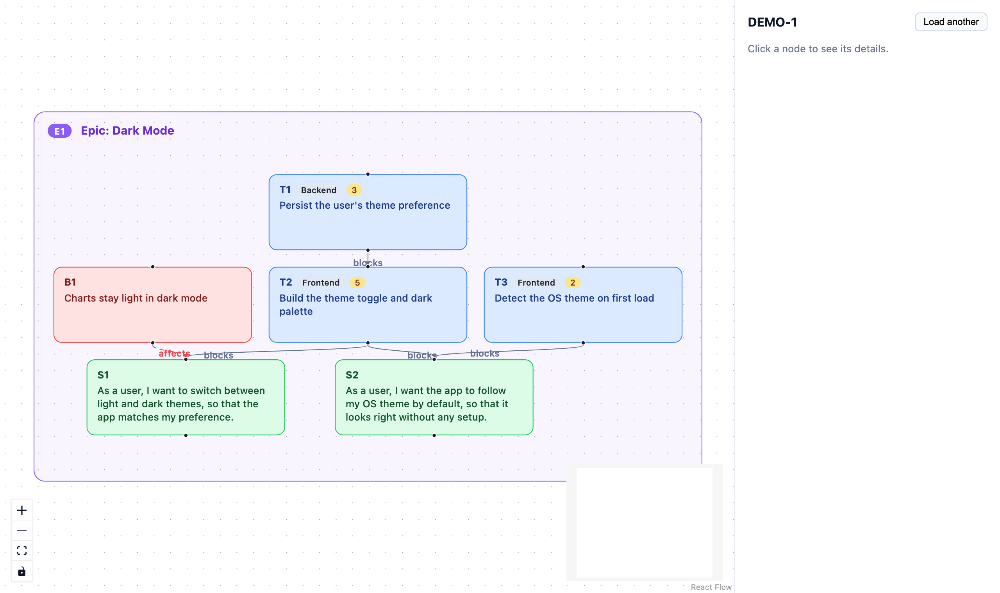

# Groomie

<!-- SonarCloud metrics below cover the companion `visualizer/` app — the plugin itself is prompt-only markdown. -->
[](https://sonarcloud.io/summary/new_code?id=mfozmen_groomie)
[](https://sonarcloud.io/summary/new_code?id=mfozmen_groomie)
[](https://sonarcloud.io/summary/new_code?id=mfozmen_groomie)
[](https://sonarcloud.io/summary/new_code?id=mfozmen_groomie)

Turn a messy Jira issue into a clean, sprint-ready backlog breakdown — as markdown.

Groomie is a [Claude Code](https://docs.claude.com/en/docs/claude-code) plugin. Point it at
one badly-written, single-feature Jira issue (vague, over-stuffed, no acceptance criteria)
and it recovers the real feature underneath, researches it as deeply as your environment
allows, and hands back a structured **epic → user stories → technical tasks** breakdown you
can review and file.

> [!NOTE]
> Groomie is **read-only against Jira** — it never creates or edits issues. It produces
> markdown you stay in control of.

## What you get

- **Epic(s)** — the feature, bounded and closeable, with a `Description` + `Business Value`.
- **User stories** (`S1`, `S2`, …) — user-facing behavior only, written as
  `As a <role>, I want <capability>, so that <benefit>.`, each with **acceptance criteria**
  and **test cases**. (A pure technical migration has no stories — Groomie won't invent them.)
- **Technical tasks** (`T1`, `T2`, …) — `[Discipline]`-tagged implementation work with a
  detailed plan, wired to what they **block** / are **blocked by** (Jira link terms).
- **Bugs** and **open questions** — surfaced, never silently invented.

The whole breakdown is saved to `<ISSUE-KEY>-groomed.md` and printed for you. The markdown ends
with a **mermaid diagram** of the blocker graph (renders on GitHub, VS Code, and other markdown
viewers). Two more files are written next to it: a machine-readable **`<ISSUE-KEY>-groomed.json`**
graph, and a standalone **`<ISSUE-KEY>-groomed.html`** — the interactive visualizer (below) with
your breakdown baked in: epics as containers, stories/tasks/bugs nested, blockers as arrows.
**Offline, double-click to open, no server or install.**



<sub>The `<ISSUE-KEY>-groomed.html` output on synthetic demo data (Jira-default colours — epic purple, story green, task blue, bug red). Click a node for its acceptance criteria, tasks, or repro.</sub>

## Requirements

- **Claude Code.**
- **Atlassian MCP** connected to your Jira — the one hard dependency; Groomie reads the issue
  through it.
- *Optional:* any research capability in your session (a code/knowledge-base MCP, web search,
  subagents). Groomie detects what's available and digs accordingly — none of it is required,
  and nothing is company-specific.

## Install

```
/plugin marketplace add mfozmen/groomie
/plugin install groomie
```

## Usage

```
/groomie PROJ-123            # full breakdown (default): epic + stories + tasks
/groomie:full PROJ-123       # same, explicit
/groomie:stories PROJ-123    # quick: epic + user stories only (behavior/scope, no tasks)
```

Pick the mode by **subcommand** (`/groomie:full`, `/groomie:stories`) or just run `/groomie`
for the default full breakdown. Full reads the code to write accurate technical tasks; stories
skips tasks for a faster, behavior-only pass. (The old `--full` / `--stories` flags still work.)

## What the output looks like

```markdown
# Epic: Dark Mode

**Description:** Let users switch the app between light and dark themes.
**Business Value:** Reduces eye strain and matches OS preference, a top-requested setting.

## Stories

### S1 — As a user, I want to switch between light and dark themes, so that the app matches my preference.

**Acceptance Criteria**
- A theme toggle is available in settings.
- The chosen theme persists across sessions.

**Test Cases**
- Toggle to dark → every screen renders in dark theme.
- Reload the app → the last chosen theme is still applied.

**Is blocked by:**
- T1 — Persist the user's theme preference
- T2 — Theme toggle + dark palette

## Tasks

### T1 — [Backend] Persist the user's theme preference
...
**Blocks:**
- S1 — As a user, I want to switch between light and dark themes …

### T2 — [Frontend] Theme toggle + dark palette
...
**Blocks:**
- S1 — As a user, I want to switch between light and dark themes …
```

## How it works

1. **Fetch** the issue from Jira (summary, description, comments, history, links).
2. **Research** the feature — following links and, when a codebase is reachable, reading the
   actual code so tasks are grounded in reality.
3. **Groom** it into the epic / stories / tasks breakdown.
4. **Save & print** the markdown (with a mermaid diagram), and write the JSON graph plus a
   standalone interactive `<ISSUE-KEY>-groomed.html` (offline, double-clickable) next to it.

---

Contributing? See [CONTRIBUTING.md](CONTRIBUTING.md). Licensed under [MIT](LICENSE).
