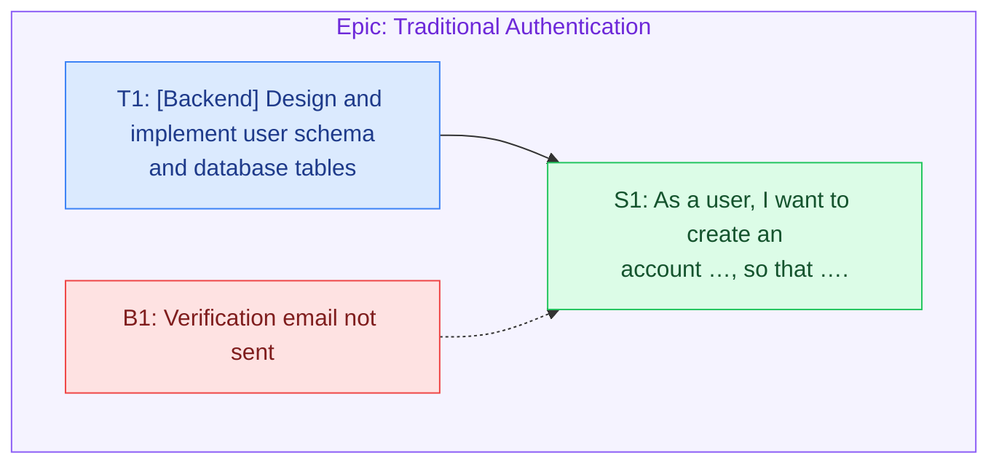

# Breakdown guide

The rules Groomie applies when grooming a feature. This is the reference; keep it
opinionated and update it as the user's preferences become clear.

## The hierarchy

```
Epic  (the feature — usually one)
 ├─ Story S1   — non-technical · QA-tested   "As a <role>, I want …, so that …."
 ├─ Story S2   — non-technical · QA-tested
 ├─ Task T1    — technical · not QA-tested   ──blocks──▶  S1
 ├─ Task T2    — technical · not QA-tested   ──blocks──▶  S1 + S2
 ├─ Task T3    — technical · not QA-tested   ──blocks──▶  S2
 └─ Bug B1     — technical or non-technical · QA-tested   (affects a story)
```

**Stories and tasks are siblings under the epic — a task is never a *subtask* of a
story.** They are distinct issue types linked only by `blocks`: stories are the
non-technical, user-facing behavior; tasks are the technical work that builds them, so
technical tasks block the stories they enable. This split drives QA: **stories are tested
by QA** (their Test Cases are what QA runs), **tasks are not** (they carry `Done when`
instead). One foundational/infrastructure task can block **many** stories (a global
blocker). Bugs are QA-tested whether they are technical or not.

## Epic

- **Usually one epic — it IS the feature.** Most issues are one feature → one epic.
  Produce **multiple epics only when the issue genuinely spans more than one distinct,
  independently bounded feature** (each one closeable on its own). Also add a second
  *Infrastructure* epic only when the feature needs substantial groundwork of its own
  (e.g. standing up a whole new microservice) — never for small setup, which is a task.
  Story/task keys (`S1`/`T1`) are unique across the **whole document** — numbering does not
  restart per epic — so every `Blocks:` / `Is blocked by:` reference is unambiguous.
- **Bounded & closeable.** An epic's scope must be finite — a coherent chunk of work
  that can realistically be completed in a defined timeframe (a few sprints, not
  "forever"). If it can never be marked "done", it's a theme, not an epic — split it.
- **The title must make that bounded scope self-evident.** Reading the title alone
  should tell you what is in scope and when it is finished. Prefer a *qualified*
  capability over an open-ended umbrella:
  - ✅ "Traditional Authentication", "SSO Integration", "Book Discovery System"
  - ❌ "Authentication", "Books", "User System", "Platform" (never close)
- **Body:** two required lines — `**Description:**` (what it implements, one sentence)
  and `**Business Value:**` (why it matters, one sentence) — plus an optional
  `**Design:**` line linking the Figma / mockups **when research surfaces them** (omit the
  line entirely if there are none). Nothing else.
- **No acceptance criteria on the epic** — stories carry the AC.
- No task list or stories inline — those are separate issues under the epic.

## User stories

- **Only when there's a user-facing behavior change.** Stories exist to capture behavior.
  If the feature changes no user-facing behavior — a pure technical migration, refactor, or
  infra work — it has **no stories**: emit the epic + tasks only. **Not every epic has
  stories.** Never fabricate operator / "system" / consumer stories to fill the layer, and
  **omit the `## Stories` section entirely** when there are none. Don't force it.
  - A **technical outcome dressed as a story is not a story.** These are the tell-tale anti-patterns
    — none of them is a story:
    - ❌ "The snapshot is queryable in the primary store" (a data-layer outcome)
    - ❌ "Existing records are backfilled safely in one pass" (an operator/migration step)
    - ❌ "The backfill is verifiable and reversible" (a task's `Done when`, not a user need)
  - If nothing rephrases into a genuine `As a <real user>, I want …, so that ….` behavior, the
    honest answer is **zero stories** — a backfill/migration is epic + `## Tasks` + `## Open
    questions`.
- Vertical, user-visible slices — **non-technical**, describing what the user experiences.
  Each delivers something a user (or operator/admin) can perceive. If a "story" has no
  user-visible outcome, it's probably a task. **QA tests stories** — the Test Cases below
  are the basis QA runs.
- **Use a real product persona — someone who actually uses what we are building.** The
  `<role>` must be an actual user of *our* product (e.g. the marketer / campaign editor /
  admin / operator on the sending side). The **end recipient / consumer of an outbound
  artifact is not our user** — never write a story from their point of view. Reframe that
  value from our user's perspective:
  - ❌ "As an email recipient, I want the email delivered as multipart …"
  - ✅ "As a campaign editor, I want my email delivered as multipart, so that recipients on
    any client see a readable version."
- **The title IS the story sentence:** `As a <role>, I want <capability>, so that <benefit>.`
  — **comma before *so that*, and a period at the end.** Give each story a Jira-style key
  `S1`, `S2`, … (a local placeholder for the Jira key assigned on filing) and put it in the
  heading. The title alone must convey the work — keep it within Jira's 255-char summary
  limit and readable; tighten the wording rather than let it sprawl. If it won't fit or reads
  as two things at once, the story is too big — split it.
- **Behavior and needs ONLY — never prescribe the solution.** A story says what the user
  needs and how the system should behave from their point of view. It must NOT direct
  engineering or design *how* to build it — no API/tech choices, no UI component names, no
  design directives.
  - ❌ "Build a REST endpoint for registration", "Add a drawer", "Disable the submit
    button", "Use a modal"
  - ✅ "The user can register with email and password", "The user cannot submit until the
    required fields are valid", "The user sees clear feedback when registration fails"
  - The HOW (REST API, drawer, Unity screen, mockups) lives in **tasks**, owned by the
    producing teams.
- **Body carries, in order:**
  - a one-line description of the capability (link PRD / business-analysis / background
    docs when they exist);
  - **Acceptance Criteria** — required. Concrete, outcome-level, checklist bullets.
  - **Test Cases** — required. Concrete `input → expected result` scenarios, including the
    key failure cases (invalid input, duplicates, edge conditions).
- **One responsibility per story — follow INVEST.** Each story is Independent, Negotiable,
  Valuable, Estimable, Small, and Testable, and covers **exactly one user capability**. If a
  story bundles two things — "edit **or** delete", "create **and** manage" — split it into
  separate stories (one to edit, one to delete). **Split whenever each resulting story stays
  independently valuable and testable** — but don't shatter one capability into
  non-independent slivers. A story needing a dozen tasks is really several stories.
- Each story states **`Is blocked by:`** the tasks that build it — **one reference per line
  as `- <key> — <title>`** (title-carrying, not the bare key; a per-line list stays
  unambiguous even though the titles contain commas). This is Jira's "is blocked by" link:

  ```
  **Is blocked by:**
  - T1 — Implement the generate-plaintext endpoint
  - T4 — Build the generate UI
  ```

## Technical tasks

- **Technical** implementation work that builds a story — this is where the HOW lives (the
  opposite of stories): tasks name the APIs, tables, screens, and components, with concrete
  steps. A task is **not a subtask of a story** — it's a distinct issue linked to the
  story by `blocks`. Tasks are **not QA-tested** (that's why they carry `Done when`, not
  Test Cases).
- **Title — imperative and one responsibility:** `[Discipline] <imperative action>` — a
  clear, complete instruction starting with a verb, e.g. `[Backend] Implement the JWT
  authentication service`, `[Backend] Create the login API endpoints`, `[Graphic Design]
  Design the login screen mockups`, `[Game Dev] Implement the login UI and session
  management` — **not a terse note.** The `[Discipline]` prefix is **required** (it routes
  the work to the producing team — we don't rely on Jira fields). Infer disciplines per
  project; common ones are Backend, Frontend, Graphic Design, Game Dev. When a
  `groomie.config.md` is present, take the discipline (and the repo→discipline mapping) from it
  instead of inferring — see *Per-project config (`groomie.config.md`)*.
- **One responsibility per task — sized to a real unit of delivery, not sliced per step.** A
  task is one coherent piece of work that one discipline can ship on its own. **Split along
  boundaries that need separate ownership, review, or CI — a different repository or a
  different discipline is always its own task.** But do **not** shatter a single
  responsibility into micro-tasks: the schema, the endpoints that use it, and their tests —
  same repo, same discipline — are **one** Backend task, not three or four. Every task
  carries real PR/CI overhead (pipelines can be long), so each must be worth its own cycle;
  **prefer a few well-scoped tasks over many tiny ones.** Split only when the work crosses a
  repo boundary, a discipline boundary, or bundles two genuinely independent deliverables —
  never just to make tasks smaller. Example: registration is a **Backend** task (schema +
  email-verification + REST endpoints + their tests, one repo) and a **Frontend/Game Dev**
  task (the UI) — plus a **Graphic Design** task only if mockups don't already exist — not
  five micro-tasks.
- **Testing and in-repo documentation belong *inside* the task, not as separate tasks.** The
  engineer writes the tests and updates in-repo docs (README, code comments, in-repo API
  docs) as part of doing the work — record them in **`Done when`** (e.g. "unit tests cover
  the new endpoints", "README updated"), never as a standalone `[QA] Write tests` or
  `[Docs] Update docs` task. **Exception:** documentation that must be produced **outside the
  repo** — e.g. a Confluence page — *especially when a company-wide process requires it* —
  may be its own task, since it's a distinct deliverable in another system. A
  `groomie.config.md` **documentation policy** makes this org-specific and explicit (see
  *Per-project config (`groomie.config.md`)*).
- **Tasks are implementation work only.** Never emit a coordination, sign-off, decision, approval,
  or meeting task (no `T0 — Decision & coordination`), and **never name a person** (no
  `Get sign-off from <name>`). An unresolved decision — which table to use, whose approval is
  needed, which endpoint is correct — is an **open question**, not a task. A task tells one
  discipline what to *build*.
- **Body — detailed, step by step:**
  - **Implementation** — concrete technical steps, detailed enough that the engineer can
    follow them without re-deriving the design.
  - **Done when** — completion criteria (what must be true for the task to be done).
- **Cover every discipline the story needs.** Backend and Frontend tasks are the core —
  produce them wherever the story touches them. Add a **Graphic Design** task (mockups /
  Figma) only when the design does not already exist; if research finds finished designs,
  skip it (reference them instead) rather than re-opening design work. If you can't tell
  whether the design exists, raise it as an open question.
- **Give each task a Jira-style key** `T1`, `T2`, … and state its links **both ways**, in
  Jira's terms, **one reference per line as `- <key> — <title>`** (title-carrying, never a
  bare key):
  - **`Blocks:`** — what it enables: the stories it unblocks (or, in a **story-less epic**,
    the tasks it must precede). A foundational task lists them all.
  - **`Is blocked by:`** — the tasks that must be done first. Omit the field when there are
    none.

  ```
  **Blocks:**
  - S1 — As a campaign editor, I want to generate a plaintext version, so that …
  **Is blocked by:**
  - T2 — Implement the HTML→plaintext converter
  ```
- A story is not "doable" until its blocking tasks are done. **Only when the epic has
  stories:** a task that blocks nothing is a smell — a missing story, or out of scope; call
  it out. Foundational / infrastructure tasks are **global blockers** — they block a whole
  set of stories (and often other tasks); mark them clearly.
- Keep each task independently completable and estimable. Split when a task crosses a
  repo/discipline boundary or bundles two genuinely independent deliverables — not merely to
  make it smaller.

## Per-project config (`groomie.config.md`)

A team may hand Groomie its company-wide conventions through an **optional** config. **The primary
way to set it is by conversation — `/groomie:config <what you want>` (see the skill's *Configure by
conversation* section); Groomie writes the file for you, so you never have to hand-edit it.** The file
below is what Groomie writes; you *may* hand-edit it, but you don't have to.

Config lives in **two places, merged so settings accumulate:**

- **Global** — `~/.groomie/config.md` in the user's home directory, applied to **every** project.
- **Per-project** — `groomie.config.md` in the working directory (or the cwd's git repo root),
  layered on top of the global file. The merge is **by kind of setting**, so nothing global is
  silently lost:
  - **Scalar settings** (Output language, Granularity, Documentation policy) — the per-project value
    wins when present; otherwise the global value; otherwise the default.
  - **List settings** (Repo → discipline, Disciplines) — the **union** of the global and per-project
    entries; a per-project entry overrides a global entry on the **same key** (e.g. the same repo).
    A per-project `## Repo → discipline` therefore *adds to / overrides* the global map, it does not
    erase it.

The skill reads the **merged** effective config during its capability probe (SKILL.md step 2). **Both
files and every section are entirely optional:** a missing file — or a missing section — changes
nothing; Groomie grooms exactly as the rest of this guide describes. It never adds a hard dependency
and never blocks a groom.

The file is plain markdown; Groomie reads these sections by heading (all optional):

```markdown
# Groomie config

## Output language
- English

## Repo → discipline
- api-service → Backend
- web-frontend → Frontend
- mobile-app → Mobile
- data-pipeline → Data

## Disciplines
- Backend
- Frontend
- Mobile
- Data

## Documentation policy
- API specs are published to Confluence as a separate task.

## Granularity
- Prefer fewer, larger tasks; consolidate same-repo/same-discipline work.
```

How each section maps onto the rules above:

- **Output language** — the language of the groomed **output content**: the `.md` prose (epic/story/
  task/bug bodies and descriptions), the node labels in the `.json` and mermaid `## Diagram`, and the
  derived `.html`. **Only human-readable content is translated — the contract skeleton stays fixed:**
  node keys (`E#`/`S#`/`T#`/`B#`), `[Discipline]` prefixes, the Jira link / bug markers
  (`Blocks:` / `Is blocked by:` / `affects:`), the fixed section/field headings (`## Tasks`, `## Open questions`,
  `## Diagram`, `Acceptance Criteria`, `Test Cases`, `Implementation`, `Done when`), and the
  `_groomie v… · <mode> breakdown_` stamp are unchanged, so `check-graph.mjs` and the visualizer keep
  working. This is **decoupled from the conversation language** — Groomie talks to the human in
  whatever language they use, but writes the output in this configured language. **Absent ⇒ English.**
- **Repo → discipline** — when research places a task's work in a repo **named in the map**, use the
  mapped discipline for its `[Discipline]` prefix (authoritative — don't re-infer), and keep the
  standing rule that a different repo is its own task. A repo **not in the map** falls back to
  per-project inference (below) — never invent a discipline, never raise an open question just
  because a repo is unmapped.
- **Disciplines** — the vocabulary this org uses for `[Discipline]` prefixes; prefer these names.
  Outside them, infer per project as usual.
- **Documentation policy** — turns the *out-of-repo docs* exception (see Technical tasks) from a
  maybe into an explicit rule: when the epic produces the artifact the policy names (e.g. API specs)
  and the policy says "separate task", emit that out-of-repo docs task. In-repo docs still stay
  inside their task.
- **Granularity** — biases the task-consolidation judgment (Technical tasks) toward the stated
  preference (e.g. consolidate more aggressively, or split finer).

Apply only what a section provides; leave everything else at its default. Partial or unfamiliar
content is ignored, not an error.

## Estimation (experimental, development-only)

Only in `--estimate` mode. Add a Fibonacci point estimate to **each task** (never to
stories or the epic) as an `**Estimate:**` field:

```markdown
### T1 — [Backend] <imperative action>
...
**Blocks:**
- S1 — <story title>
**Estimate:** 5   <!-- Fibonacci: 1, 2, 3, 5, 8, 13, 21 -->
```

Base the number on task complexity + how much code it touches. These are a **rough first
pass** — Groomie cannot judge real effort accurately yet, so they must be **calibrated over
time** against actuals. Treat them as directional. Per-story / per-epic roll-up (summing
task points) is a planned later addition. Do not surface this mode to end users yet.

## Bugs

- Only when the source issue actually reports existing behavior that is broken.
- A missing feature is a story/task, not a bug.
- A bug may be **technical or non-technical** — either way it is **QA-tested** (like a
  story), so it does not matter which; give steps to reproduce, expected vs actual (the
  repro + expected/actual is the bug's QA basis — its equivalent of a story's Test Cases).
- **Give each bug a key `B1`, `B2`, …** (like `S#`/`T#`) and link it to the story it affects
  with `affects: S1`, so it's traceable in the diagram (`B# -.-> S#`).

## Open questions

Anything ambiguous in the source issue becomes an explicit open question — never a
silently invented requirement. List them at the end so the user can resolve them before
the work is filed.

## Output shape

```markdown
# Epic: <bounded capability name>

_groomie v<version> · <mode> breakdown_   <!-- version from .claude-plugin/plugin.json; mode = full|stories|estimate; see SKILL.md step 5 -->

**Description:** <what the feature implements — one sentence>

**Business Value:** <why it matters — one sentence>

**Design:** <Figma / mockup links>   <!-- optional; omit the line if research found none -->

## Stories   <!-- omit this whole section when there's no user-facing behavior change -->

### S1 — As a <role>, I want <capability>, so that <benefit>.

<one-line description; link PRD / background docs if any>

**Acceptance Criteria**
- ...

**Test Cases**
- <input> → <expected result>
- <failure case> → <expected result>

**Is blocked by:**
- T1 — <task title>
- T2 — <task title>

---

### S2 — As a <role>, I want <capability>, so that <benefit>.

...

**Is blocked by:**
- T3 — <task title>

## Tasks

### T1 — [Backend] <imperative action>

**Implementation**
- ...

**Done when**
- ...

**Blocks:**
- S1 — <story title>

---

### T2 — [Frontend] <imperative action>

...

**Blocks:**
- S1 — <story title>

---

### T3 — [Backend] <foundational imperative action>

**Implementation**
- ...

**Done when**
- ...

**Blocks:**
- S1 — <story title>
- S2 — <story title>   <!-- one task can block many stories -->

## Bugs   <!-- omit this section if there are none -->

- **B1 — <title>** — repro / expected / actual · affects: S1

## Open questions

- ...

## Diagram

(a mermaid flowchart TD block — see the "Diagram (mermaid)" section below; omit if no nodes)
```

The samples in `examples.md` are the source of truth for the shape of each individual
epic / story / task — when they differ from this skeleton, the samples win. This skeleton
only shows how the pieces lay out together in one document.

**Omit every empty section.** Only include a section that has content: no user-facing
behavior change → no `## Stories`; no bugs → no `## Bugs`; no open questions → no
`## Open questions`. Never print an empty heading or a "(none)" placeholder. A pure
technical migration, for example, is often just the epic + `## Tasks` + `## Open questions`.

**Emit these sections and no others.** The allowed set is exactly: the `# Epic:` block (with its
version-stamp line), `## Stories`, `## Tasks`, `## Bugs`, `## Open questions`, `## Diagram`. Do
**not** add a `TL;DR` / executive summary / "the work, simplified", a `Locked decisions` /
decisions / evidence / rationale table, an `Epic (context)` preamble, or any narrative that
critiques, "refutes", or re-summarizes the ticket. Research shapes the *content* of the sections
above; it is never a section of its own.

**Mode deltas** (see the skill's Modes section): in `--stories` mode omit the `## Tasks`
section entirely; in `--estimate` mode each task carries an `**Estimate:**` line
(Fibonacci — see Estimation above). The version stamp's `<mode>` word follows the run:
`full`, `stories`, or `estimate`.

## Revising a breakdown

When editing an **already-produced** breakdown (the skill's *Revise* flow) rather than grooming
fresh, the same rules above still apply to every node you touch — plus three invariants that keep the
`.md` and `.json` coherent across an edit:

- **Keys are stable and never reused.** Existing `E#`/`S#`/`T#`/`B#` keys never renumber. A removed
  node's key is **retired** — a later add takes the next free number, not the freed one — so any
  reference the user kept elsewhere stays valid.
- **Edges follow the nodes.** Removing a node drops every edge that touches it (and any dangling
  `Blocks:` / `Is blocked by:` line). Splitting a node re-wires its `blocks` to the right halves.
  The MD's link lines and the JSON's directed edges must state the **same** blocker→blocked pairs,
  deduped.
- **Edit only what the change implies.** Touch the named node(s) plus the unavoidable key/edge
  consequences; leave every other node's wording and keys byte-for-byte unchanged. This preserves the
  consistency guarantee for the parts the user didn't ask to change.

A committed synthetic pair lives at `references/fixtures/revise-e2e.{md,json}` (the revise
end-to-end test's fixed input), and `scripts/check-graph.mjs` asserts these invariants — it also
runs as the skill's post-revise self-check.

## Diagram (mermaid)

End the document with a `## Diagram` section containing **one fenced `mermaid` `flowchart TD`**
that renders the breakdown as a graph. Emit it only when there is at least one node.

- **One `subgraph epicN["Epic: <name>"]` per epic** (the container); the epic's story / task /
  bug nodes nest inside it. Ids `epic1`, `epic2`, … by order.
- **Nodes** use the existing keys: `S1["S1: <summary>"]`, `T1["T1: [Discipline] <summary>"]`.
  Bugs get diagram ids `B1`, `B2`, … by order.
- **Edges:** blocking is a solid directed edge from blocker to blocked — `T1 --> S1`
  (task→story) and `T2 --> T4` wherever one task must precede another (task→task sequencing,
  in any epic); a bug's `affects` is dashed, `B1 -.-> S1`. Emit each edge **once** (the markdown
  stores blocking on both endpoints — dedupe here).
- **Colour by kind** (Jira defaults) with a `classDef` block: story green, task blue, bug red;
  the epic subgraph gets a purple tint via a `style epic1 …` line.
- **Labels carry the node's full title (like the HTML visualizer), not a short gist.** Build each
  label **in this order — the order matters**:
  1. **Take** the node's own title: a story's whole `As a …, I want …, so that ….` sentence, a task's
     imperative title, an epic's name.
  2. **Sanitize** it — *before* inserting any markup — by removing the characters that break a quoted
     `["…"]` label: `"`, `#`, `<`, `>`, `|`, and backticks; replace `&` with `and`; collapse runs of
     whitespace. **Keep** commas, periods, parentheses, brackets `[` `]`, braces `{` `}`, `%`, slashes,
     apostrophes, colons, and hyphens — all safe inside the quoted label.
  3. **Cap** a very long title at ~130 characters: cut at a word boundary and append `…`. This cap is
     **mermaid-only** (it keeps boxes readable); the full text still lives in the node's `.md` body and
     the HTML visualizer, which don't cap. (A long "As a …, so that …." story is the usual case.)
  4. **Wrap** the sanitized, capped text with `<br/>` at word boundaries — **every ~34 characters for
     story / task / bug nodes, and ~80 for the epic subgraph title** (matching the visualizer's
     `wrap(title, 34)` for items and `wrap(epic.title, 80)` for epics). Insert `<br/>` **only here**,
     after sanitizing, so the `<`/`>` you just added aren't stripped.
  5. **Prefix** the front with the `S1: ` / `Epic: ` scaffolding, a task's `[Discipline]` tag, and (in
     `--estimate`) a trailing `(5)`. The prefix rides inline on the first line — the visualizer puts
     the id/discipline on a separate row instead — so a node's first line runs a little past ~34, which
     is expected.
- **Modes:** `--stories` → no task nodes and no `-->` edges (stories may still have dashed bug
  edges); `--estimate` → append the point to the task label after the wrapped title,
  `T1["T1: [Backend] Design and implement user schema<br/>and database tables (5)"]`.

This mirrors the *JSON graph output* example below node-for-node — each label is that node's own title
run through steps 1–5 above (the `S1: ` / `[Discipline]` scaffolding on the front):



## JSON graph output

Alongside the markdown (in the same per-issue `<ISSUE-KEY>/` folder), write
`<ISSUE-KEY>/<ISSUE-KEY>-groomed.json` — the **same graph, machine-readable**
(the visualizer's input). One flat `nodes[]` array (epics are first-class `kind:"epic"` nodes)
plus a directed `edges[]` array. Epics get JSON-only ids `E1`, `E2`, … (the markdown `# Epic:`
heading is unchanged); every non-epic node carries `epicId`. Edges are deduped.

```json
{
  "issueKey": "PROJ-123",
  "mode": "estimate",
  "nodes": [
    { "id": "E1", "kind": "epic", "title": "Traditional Authentication",
      "description": "...", "businessValue": "...", "design": null },
    { "id": "S1", "kind": "story", "epicId": "E1",
      "title": "As a user, I want to create an account …, so that ….",
      "description": "Lets new users register with email and password.", "links": [],
      "acceptanceCriteria": ["..."], "testCases": ["..."] },
    { "id": "T1", "kind": "task", "epicId": "E1",
      "title": "Design and implement user schema and database tables",
      "discipline": "Backend", "implementation": ["..."], "doneWhen": ["..."], "estimate": 5 },
    { "id": "B1", "kind": "bug", "epicId": "E1", "title": "Verification email not sent",
      "repro": "...", "expected": "...", "actual": "..." }
  ],
  "edges": [
    { "source": "T1", "target": "S1", "kind": "blocks" },
    { "source": "B1", "target": "S1", "kind": "affects" }
  ]
}
```

Rules:
- `mode ∈ full | stories | estimate`. Common node fields: `id`, `kind` (`epic|story|task|bug`),
  `title`. Non-epic nodes carry `epicId`.
- **Story:** `description` (the one-liner), `links[]` (PRD / background docs, `[]` if none),
  `acceptanceCriteria[]`, `testCases[]` (the markdown bullets, split).
- **Task:** `discipline` (from the `[Discipline]` prefix), `implementation[]`, `doneWhen[]`,
  and `estimate` **only in `--estimate`**.
- **Bug:** `repro`, `expected`, `actual`.
- **Edges** are directed **blocker → blocked**, `kind ∈ blocks | affects`, **deduped**. Derive
  `blocks` edges from **both** a task's `Blocks:` and any `Is blocked by:` (the two directions of
  the same link): task→story wherever a task builds a story, **and task→task wherever one task
  must precede another** (sequencing — in any epic, not only story-less ones). From an
  `Is blocked by:` list the **listed** node is the `source` (blocker) and the owning node is the
  `target`; from a `Blocks:` list the owning node is the `source` — both yield the same
  blocker→blocked edge, so dedup them. `affects` runs bug→story.
- **Modes:** `--stories` → no `task` nodes and no `blocks` edges (bug `affects` stays);
  `--estimate` → each task node has `estimate`. The `nodes`/`edges` arrays always exist.
- An optional top-level **`jira`** key may be present — the write-back ledger (see *Jira write-back*
  below). It is data only: `check-graph.mjs` and the visualizer read solely `nodes`/`edges` and
  ignore it.

## Jira write-back (`/groomie:push`)

`/groomie:push <ISSUE-KEY>` writes a finalized breakdown into Jira via the Atlassian MCP —
**opt-in, idempotent, and only after an approved preview** (see SKILL.md's *Push to Jira* flow). This
section defines the data contract; the flow defines the behavior.

**The ledger.** The JSON gains a top-level `jira` object recording every issue groomie owns for this
breakdown:

```json
"jira": {
  "project": "PROJ",
  "epicMode": "source-as-epic",
  "pushed": { "E1": "PROJ-123", "S1": "PROJ-457", "T1": "PROJ-460" },
  "tombstoned": []
}
```

- `pushed` maps a groomie node id → the Jira key groomie created/owns for it. **Entries are never
  removed** — a node later dropped from the breakdown keeps its entry so its now-orphan Jira issue can
  still be found and tombstoned. Each key is written **immediately** after a successful create, so a
  mid-run failure resumes as an UPDATE, never a duplicate CREATE.
- `tombstoned` is the list of node ids already `[deleted]`-marked; the push flow skips these so it
  never re-prepends the prefix (a local check — no live Jira read needed).
- Under **`source-as-epic`** the epic node maps to the **source issue key itself** (`E1` → `PROJ-123`
  above — the source `<KEY>`, seeded before the first push, updated in place, never re-created). Under
  **`new-epic`** the epic gets a fresh created key like the stories/tasks.
- `epicMode ∈ source-as-epic | new-epic` is **chosen on the first push and recorded, then reused
  (locked) on every re-push** — a breakdown can't switch epic modes (that would orphan the epic a
  prior push created). `project` is the target Jira project (default: the source issue's project).

**Mapping.** (Names marked *verify on demo Jira* are assumptions to confirm on a real instance — never
against production during development.)

- **Kind → issue type:** `epic`→Epic, `story`→Story, `task`→Task, `bug`→Bug. A story/task/bug is a
  **child of its epic** via the epic-link / parent field (*verify on demo Jira*).
- **Edge → link:** `blocks`→Jira **"Blocks"**; `affects`→**"Relates"** unless the instance has a
  closer type (*verify on demo Jira*). Skip a link that already exists between the two keys.
- **Fields:** **summary** = the node title (a story's full `As a …` sentence; trim to Jira's summary
  limit and carry the overflow into the description). **description** = the node body — a story's
  description + Acceptance Criteria + Test Cases, a task's Implementation + Done when, a bug's
  repro/expected/actual. Description format (ADF vs wiki markup) is an MCP detail (*verify on demo
  Jira*).

**Upsert scope.** An UPDATE overwrites **only** the groomie-owned fields — **summary, description, and
the blocks/affects links groomie created** — and **never** touches status, assignee, sprint, priority,
comments, or any other field, so a re-push refreshes content without destroying workflow state.

**Removed nodes (`[deleted]`).** A `pushed` entry whose node id is no longer in the current breakdown
is an orphan. Groomie **does not delete or transition it** — it prepends `[deleted] ` to the issue's
summary (once — the node id is added to `jira.tombstoned` and skipped on later pushes by that local
check, no live read) as a reversible tombstone, and keeps the ledger entry. The `[deleted] ` prefix is
a **fixed English marker**, independent of `## Output language`.
