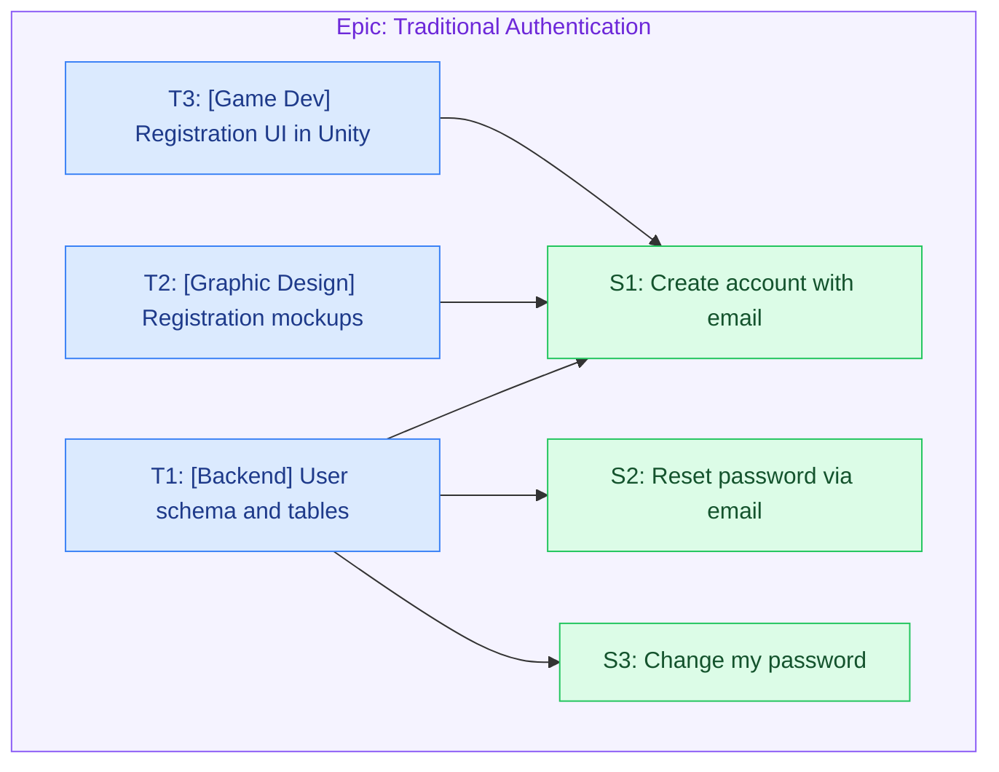

# Examples

Gold-standard reference output that calibrates Groomie's style, granularity, and tone.
When these examples conflict with the breakdown guide, **the examples win.** They are
drawn from a well-groomed backlog (the "SAP" reference project) and grow as the user
adds more. If a section below is still empty, fall back to the breakdown guide's shape
for that level.

> Note: the SAP reference project is an **animated-books Unity game**, so its client tier
> is `[Game Dev]` (Unity) rather than `[Frontend]`. Infer the disciplines from the actual
> project you are grooming — don't copy `[Game Dev]` onto a non-game feature.

## Epic

A good epic is bounded, closeable in a defined timeframe, and its scope is obvious from
the title alone. Body is two required lines — `Description` + `Business Value` — plus an
optional `Design:` line linking the Figma / mockups when research surfaces them. No
acceptance criteria (stories carry those).

```markdown
# Epic: Traditional Authentication

**Description:** Implement email/password-based authentication system.

**Business Value:** Provide secure basic authentication method for users who prefer
traditional login.
```

```markdown
# Epic: SSO Integration

**Description:** Implement Single Sign-On functionality supporting major identity providers.

**Business Value:** Simplify the login process and increase user adoption.
```

Both titles pass the "is it bounded?" test — you can tell what's in scope and when it's
done just by reading them. Contrast with an un-scoped umbrella like "Authentication",
which never closes.

## User stories

The title carries the full user-story sentence (within Jira's summary length). Note this
example describes **only behavior and needs** — nothing about REST APIs, screens, or
widgets. Body: a short description, then Acceptance Criteria, then concrete Test Cases —
both required.

```markdown
### S1 — As a user, I want to create an account using email and password, so that I can have my own personal access to the platform.

Lets new users create an account with email and password, including email verification
and clear success/error feedback. (Link the PRD / business-analysis pages when they exist.)

**Acceptance Criteria**
- Valid email verification process
- Password strength requirements enforced
- Account verification flow
- Success/error notifications

**Test Cases**
- Valid email + strong password → account created, verification email sent
- Weak password → rejected with a strength hint
- Duplicate email → clear "already registered" error
- Clicking the verification link → account marked as verified

**Is blocked by:**
- T1 — Design and implement user schema and database tables
- T2 — Design registration flow UI mockups
- T3 — Implement registration UI using Unity
```

(Keyed `S1`; note the comma before *so that* and the period at the end, one responsibility
(INVEST), and blocking refs carry `<key> — <title>`. "user" here is a real product persona —
the game's player. Never write a story as the recipient of an outbound artifact.)

## Technical tasks

Tasks carry the HOW. Each is keyed (`T1`, `T2`, …), the title is an **imperative** action
under a required discipline prefix (one responsibility per task), and the body is a
detailed, step-by-step `Implementation` plus `Done when`, then `Blocks:` / `Is blocked by:`
as `<key> — <title>` (Jira's link terms). A single story is usually built by several tasks
across disciplines (the account-creation story above is built by `[Backend]`,
`[Graphic Design]`, and `[Game Dev]` tasks — a separate task each, split by responsibility);
conversely one foundational task underpins several stories, as the `[Backend]` schema task
below shows.

```markdown
### T1 — [Backend] Design and implement user schema and database tables

Model and create the user data structures with secure credential storage and
email-verification fields.

**Implementation**
- Create a users table: id (UUID), email (unique, case-insensitive), password_hash,
  email_verified (bool), status, created_at/updated_at.
- Store only hashed passwords (bcrypt/argon2) — never plaintext.
- Add email-verification storage: token hash, expiry, and used flag.
- Add a unique index on email and write migration scripts.

**Done when**
- Migrations create the tables and email uniqueness is enforced at the DB level.
- Repository CRUD operations are covered by tests.

**Blocks:**
- S1 — As a user, I want to create an account using email and password …
- S2 — As a user, I want to reset my password via email …
- S3 — As a logged-in user, I want to change my password …
```

This backend task is a good illustration of the model: it is **not a subtask** of any one
story — it's a foundational piece that `Blocks:` every account-related story it underpins.
It carries `Done when` (not Test Cases) because tasks are not QA-tested; the stories it
blocks are the ones QA verifies.

## Diagram

The document ends with a `## Diagram` mermaid block: one `subgraph` per epic (container),
`S#`/`T#`/`B#` nodes, solid arrows for blocking and dashed for a bug's `affects`, coloured by
kind. Labels are short sanitized gists (see the breakdown guide). For the account example:


