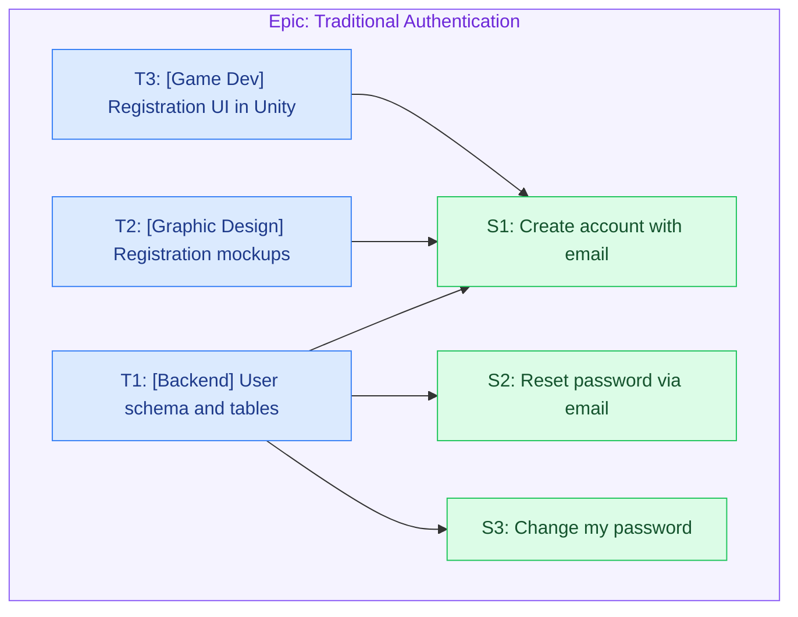

# Examples

Gold-standard reference output that calibrates Groomie's style, granularity, and tone.
When these examples conflict with the breakdown guide, **the examples win.** They are
drawn from a well-groomed backlog (the "SAP" reference project) and grow as the user
adds more. If a section below is still empty, fall back to the breakdown guide's shape
for that level.

> Note: the SAP reference project is an **animated-books Unity game**, so its client tier
> is `[Game Dev]` (Unity) rather than `[Frontend]`. Infer the disciplines from the actual
> project you are grooming — don't copy `[Game Dev]` onto a non-game feature.

## Epic

A good epic is bounded, closeable in a defined timeframe, and its scope is obvious from
the title alone. Body is two required lines — `Description` + `Business Value` — plus an
optional `Design:` line linking the Figma / mockups when research surfaces them. No
acceptance criteria (stories carry those).

```markdown
# Epic: Traditional Authentication

_groomie v<version> · full breakdown_

**Description:** Implement email/password-based authentication system.

**Business Value:** Provide secure basic authentication method for users who prefer
traditional login.
```

```markdown
# Epic: SSO Integration

_groomie v<version> · full breakdown_

**Description:** Implement Single Sign-On functionality supporting major identity providers.

**Business Value:** Simplify the login process and increase user adoption.
```

Both titles pass the "is it bounded?" test — you can tell what's in scope and when it's
done just by reading them. Contrast with an un-scoped umbrella like "Authentication",
which never closes.

## User stories

The title carries the full user-story sentence (within Jira's summary length). Note this
example describes **only behavior and needs** — nothing about REST APIs, screens, or
widgets. Body: a short description, then Acceptance Criteria, then concrete Test Cases —
both required.

```markdown
### S1 — As a user, I want to create an account using email and password, so that I can have my own personal access to the platform.

Lets new users create an account with email and password, including email verification
and clear success/error feedback. (Link the PRD / business-analysis pages when they exist.)

**Acceptance Criteria**
- Valid email verification process
- Password strength requirements enforced
- Account verification flow
- Success/error notifications

**Test Cases**
- Valid email + strong password → account created, verification email sent
- Weak password → rejected with a strength hint
- Duplicate email → clear "already registered" error
- Clicking the verification link → account marked as verified

**Is blocked by:**
- T1 — Design and implement user schema and database tables
- T2 — Design registration flow UI mockups
- T3 — Implement registration UI using Unity
```

(Keyed `S1`; note the comma before *so that* and the period at the end, one responsibility
(INVEST), and blocking refs carry `<key> — <title>`. "user" here is a real product persona —
the game's player. Never write a story as the recipient of an outbound artifact.)

## Technical tasks

Tasks carry the HOW. Each is keyed (`T1`, `T2`, …), the title is an **imperative** action
under a required discipline prefix (one responsibility per task), and the body is a
detailed, step-by-step `Implementation` plus `Done when`, then `Blocks:` / `Is blocked by:`
as `<key> — <title>` (Jira's link terms). A single story is usually built by several tasks
**split across disciplines / repos** (the account-creation story above is built by one
`[Backend]`, one `[Graphic Design]`, and one `[Game Dev]` task — a separate task per
discipline, not per step); conversely one foundational task underpins several stories, as the
`[Backend]` schema task below shows. Note two things about that Backend task. First, it
**consolidates** the schema, the migrations, and *its own tests* into one unit — tests appear
in `Done when`, never a separate `[QA]` task. Second, because this schema is **shared** by
S1/S2/S3, it stands alone as a **foundational task** that `Blocks:` all three (a global
blocker), rather than being duplicated per story; where a schema serves just **one** story you
would instead fold it into that story's Backend task (schema + its endpoints + tests together),
as the guide's registration example does. Either way the target is one shippable unit per
discipline — never a micro-task per endpoint or a standalone tests/docs task.

```markdown
### T1 — [Backend] Design and implement user schema and database tables

Model and create the user data structures with secure credential storage and
email-verification fields.

**Implementation**
- Create a users table: id (UUID), email (unique, case-insensitive), password_hash,
  email_verified (bool), status, created_at/updated_at.
- Store only hashed passwords (bcrypt/argon2) — never plaintext.
- Add email-verification storage: token hash, expiry, and used flag.
- Add a unique index on email and write migration scripts.

**Done when**
- Migrations create the tables and email uniqueness is enforced at the DB level.
- Repository CRUD operations are covered by tests.

**Blocks:**
- S1 — As a user, I want to create an account using email and password …
- S2 — As a user, I want to reset my password via email …
- S3 — As a logged-in user, I want to change my password …
```

This backend task is a good illustration of the model: it is **not a subtask** of any one
story — it's a foundational piece that `Blocks:` every account-related story it underpins.
It carries `Done when` (not Test Cases) because tasks are not QA-tested; the stories it
blocks are the ones QA verifies.

## Anti-patterns (what a groomed doc must never do)

Calibration on a **backfill/migration** issue — one that copies existing data into a new store and
changes **no** user-facing behavior. Every item below is a real failure mode; the fix is the honest
shape. (Synthetic example — a generic "snapshot legacy records into the primary store" migration.)

- **A TL;DR / executive summary / "the work, simplified" / decisions or evidence table.** ❌ Only
  the contracted sections exist (epic → stories? → tasks → bugs? → open questions → diagram).
  Research shapes the *content*; it is never its own narrative, and the doc never critiques,
  "refutes", or re-summarizes the ticket.
- **Technical outcomes dressed as stories.** ❌ `S1 — The snapshot is queryable in the primary
  store`, `S2 — Existing records are backfilled safely in one pass`, `S3 — The backfill is verifiable and
  reversible`. None is an `As a <real user>, I want …, so that ….` behavior — so a pure migration
  has **zero stories**. ✅ Emit just the epic + `## Tasks` + `## Open questions`.
- **A coordination / sign-off / decision task.** ❌ `T0 — Decision & coordination (blocking): get
  DBA sign-off`. Tasks are implementation only and never name a person. ✅ The unresolved decisions
  (which holder table, whose approval, the schema-change process) go under `## Open questions`.
- **A standalone tests task.** ❌ `T4 — Tests`. ✅ Tests live in the producing task's `Done when`
  (e.g. the backfill task's "unit tests cover happy-path, idempotency, and count-verify").

So the bad run's `TL;DR + S1/S2/S3 + T0 + …T4(Tests) + Locked decisions` collapses to the honest
shape: **one epic, a handful of implementation tasks (schema, backfill+verify+tests), and the open
questions** — with the `_groomie v<version> · <mode> breakdown_` stamp under the epic heading.

## Revising a breakdown

When the user edits an existing breakdown (the skill's *Revise* flow), keep existing keys stable and
re-wire only what the change implies. Worked example on the auth breakdown above — the user says
**"split T3 (the Unity registration UI) into the screen build and session management."**

- `T3` **stays** the screen-build task; the new session-management work becomes **`T4`** — the next
  free key, never a renumber of the existing tasks. Both still block `S1`.
- Edges before: `T1→S1`, `T2→S1`, `T3→S1`. After: `T1→S1`, `T2→S1`, `T3→S1`, **`T4→S1`** — the split
  adds one edge; the others are untouched.
- In the MD, `S1`'s `Is blocked by:` gains `- T4 — [Game Dev] …`, and the new `### T4` task states
  `Blocks: - S1 — …`; the JSON gains the `T4` node + the `T4→S1` `blocks` edge. `T1`/`T2`'s wording is
  unchanged.

Contrast a **removal** — "drop S2": delete the `S2` node and every edge touching it (e.g. a
`T3→S2` blocks edge and any `Is blocked by: T3` line that only served `S2`), and **do not** reassign
`S2` to some other story later. A subsequent "add a story" takes `S3`, not the retired `S2`.

## Per-project config

When a `groomie.config.md` sits in the working directory, Groomie applies it (see the breakdown
guide's *Per-project config* section). Example config (all sections optional, all values synthetic):

```markdown
# Groomie config

## Repo → discipline
- api-service → Backend
- web-frontend → Frontend

## Documentation policy
- Public API changes are documented on Confluence as a separate task.
```

Grooming a "publish a new public REST endpoint" feature **with** this config vs. **without** it:

- **Without config:** the API work is one inferred `[Backend]` task; API docs fold into its
  `Done when` (in-repo docs stay in the task).
- **With config:** the same work lands in the `api-service` repo → the task is `[Backend]` **from the
  map**, and because the documentation policy names public-API docs as a separate Confluence task, a
  distinct `[Docs] Document the endpoint on Confluence` task appears alongside it. A task landing in a
  repo the map doesn't list (say `search-indexer`) still gets an inferred discipline — the missing
  mapping never blocks or invents.

The user sets all of this **by conversation**, never by hand. Running `/groomie:config outputs in
Turkish` while chatting in English makes Groomie write `## Output language: Turkish` to the global
`~/.groomie/config.md` and reply `Set Output language = Turkish (global).` — it does **not** groom.
The next `/groomie <KEY>` then produces the breakdown **content in Turkish** (epic/story/task prose,
node labels) while the conversation stays in English and the skeleton stays fixed: the keys
(`S1`/`T1`), the `[Discipline]` prefixes, the `Blocks:` / `Is blocked by:` link terms, the
`Acceptance Criteria` / `Test Cases` / `Implementation` / `Done when` headings, and the version stamp
are unchanged — so a Turkish breakdown still passes `check-graph.mjs` and renders in the visualizer.
With no `## Output language` anywhere, output stays English.

## Diagram

The document ends with a `## Diagram` mermaid block: one `subgraph` per epic (container),
`S#`/`T#`/`B#` nodes, solid arrows for blocking and dashed for a bug's `affects`, coloured by
kind. Labels are short sanitized gists (see the breakdown guide). For the account example:


