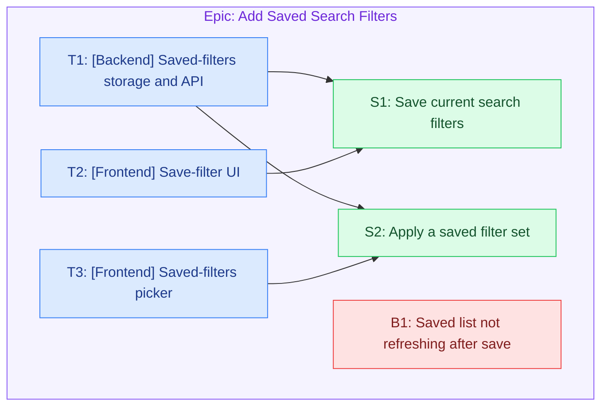

# Epic: Add Saved Search Filters

_groomie v0.0.0 · full breakdown_

**Description:** Let shoppers save a set of search filters and re-apply it later.

**Business Value:** Shoppers who refine long filter lists can return to them without re-entering, increasing repeat search use.

## Stories

### S1 — As a shopper, I want to save my current search filters, so that I can reuse them later.

Lets a shopper name and store the filters currently applied to a search.

**Acceptance Criteria**
- A shopper can save the active filter set with a name.
- Saved sets are listed for the shopper on their next visit.
- Saving shows a clear success or error message.

**Test Cases**
- Save with a unique name → set stored, appears in the saved list.
- Save with a name already used → clear duplicate-name error.
- Save with no active filters → save action is unavailable.

**Is blocked by:**
- T1 — Implement saved-filters storage and API
- T2 — Build the save-filter UI

---

### S2 — As a shopper, I want to apply a saved filter set in one click, so that I do not have to re-enter filters.

Lets a shopper pick a previously saved set and apply all its filters at once.

**Acceptance Criteria**
- A shopper can pick a saved set from a list.
- Applying a set replaces the current filters with the saved ones.
- The result count updates to reflect the applied filters.

**Test Cases**
- Apply a saved set → all its filters become active and results refresh.
- Apply a set whose filter no longer exists → that filter is skipped with a notice.
- Empty saved list → the picker shows an empty state.

**Is blocked by:**
- T1 — Implement saved-filters storage and API
- T3 — Build the saved-filters picker

## Tasks

### T1 — [Backend] Implement saved-filters storage and API

**Implementation**
- Add a saved_filters table: id, shopper_id, name (unique per shopper), filter_json, created_at.
- Expose create / list / apply-read endpoints scoped to the current shopper.
- Validate names for per-shopper uniqueness and reject empty filter sets.

**Done when**
- Endpoints create, list, and read saved filter sets for a shopper.
- Per-shopper name uniqueness is enforced at the DB level.
- Unit tests cover create, list, duplicate-name, and empty-set cases.

**Blocks:**
- S1 — As a shopper, I want to save my current search filters, so that I can reuse them later.
- S2 — As a shopper, I want to apply a saved filter set in one click, so that I do not have to re-enter filters.

---

### T2 — [Frontend] Build the save-filter UI

**Implementation**
- Add a Save control to the filter bar that opens a name prompt.
- Call the create endpoint and show success/error feedback.
- Disable the control when no filters are active.

**Done when**
- A shopper can name and save the active filters from the search page.
- Success and duplicate-name errors are surfaced inline.
- Component tests cover the enabled/disabled and error states.

**Blocks:**
- S1 — As a shopper, I want to save my current search filters, so that I can reuse them later.

---

### T3 — [Frontend] Build the saved-filters picker

**Implementation**
- Add a picker listing the shopper's saved sets.
- On selection, read the set and apply its filters to the current search.
- Show an empty state when the shopper has no saved sets.

**Done when**
- Selecting a saved set applies its filters and refreshes results.
- The empty state renders when there are no saved sets.
- Component tests cover selection, empty, and missing-filter cases.

**Blocks:**
- S2 — As a shopper, I want to apply a saved filter set in one click, so that I do not have to re-enter filters.

## Bugs

### B1 — Saved-filters list does not refresh after a save

**Reproduce Steps**
1. Save a new filter set.
2. Reopen the saved list without reloading the page.

**Expected Behaviour**
The newly saved set appears in the list immediately.

**Actual Behaviour**
The list still shows the pre-save sets until a full page reload.

## Diagram

